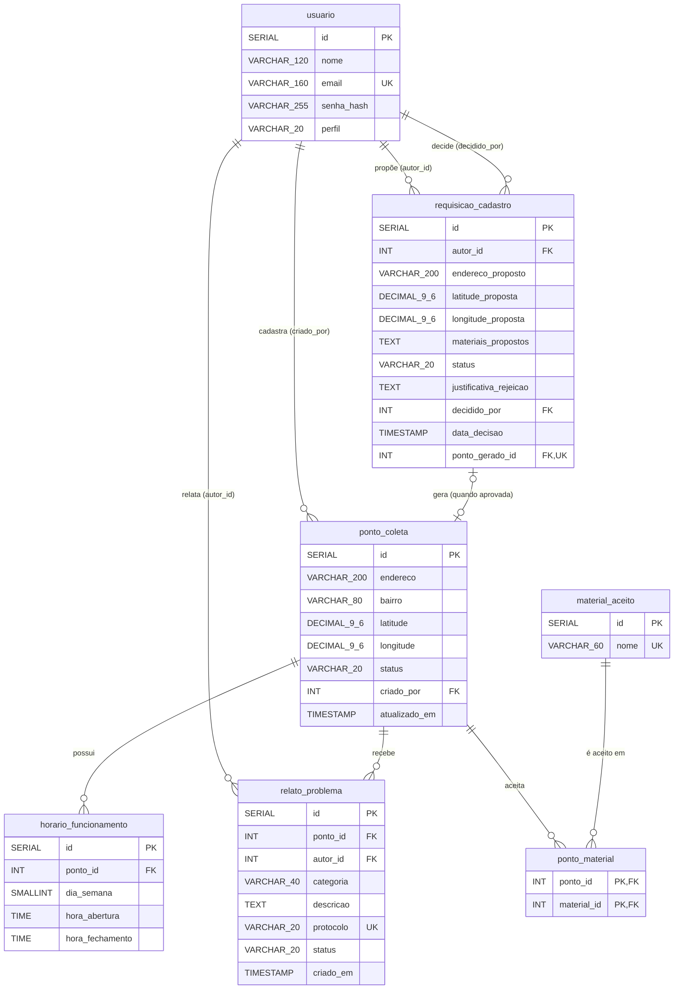

# DER

## Dados de Entrega

Equipe:

- Adrian Souza Teixeira (RA 2840482421051)
- Heitor Benedetti Lopes (RA 2840482421003)
- Victor Breno Anastácio de Matos (RA 2840482313038)

Trilha: B 

Data: 04/09/2026

## Conteúdo

