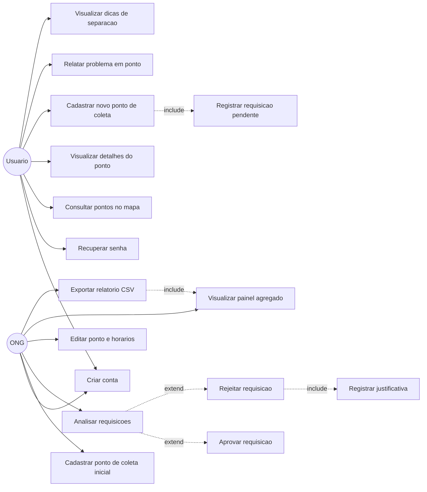
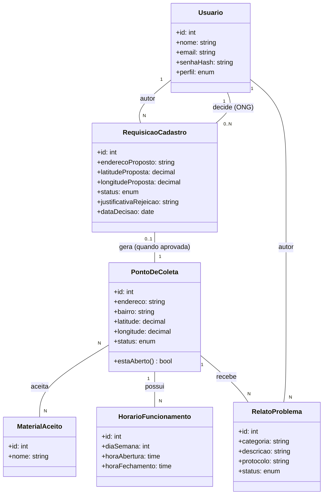

# Diagramas UML - RP Recicla

## Dados da Entrega

Equipe: 

- Adrian Souza Teixeira (RA 2840482421051)
- Heitor Benedetti Lopes (RA 2840482421003) 
- Victor Breno Anastácio de Matos (RA 2840482313038)
  
Trilha: B

Data: 04/09/2026

## Conteúdo

### Diagrama de Casos de Uso

### Diagrama de Classes

### Rastreabilidade — caso de uso → história do backlog (E2)

| Caso de uso | História(s) relacionada(s) (E2) |
|---|---|
| Criar conta | #1 |
| Recuperar senha | #2 |
| Cadastrar ponto de coleta inicial | #3 |
| Consultar pontos no mapa | #4 |
| Visualizar detalhes do ponto | #5 |
| Cadastrar novo ponto de coleta + Registrar requisição pendente | #6 |
| Analisar requisições + Aprovar/Rejeitar requisição + Registrar justificativa | #7 |
| Relatar problema em ponto | #8 |
| Editar ponto e horários | #9 |
| Visualizar painel agregado | #10 |
| Exportar relatório CSV | #11 |
| Visualizar dicas de separação | #12 |
